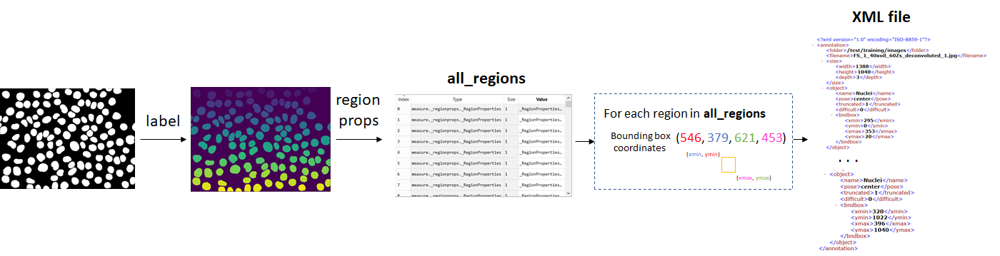

# From binary masks to XML files based on Pascal VOC format

Code to create XML files based on Pascal VOC format from binary segmentation masks in order to train the YOLO architecture.

This code was written in order to obtain XML files to train the Fast YOLO architecture of the approach proposed in https://link.springer.com/chapter/10.1007/978-3-030-31332-6_5
